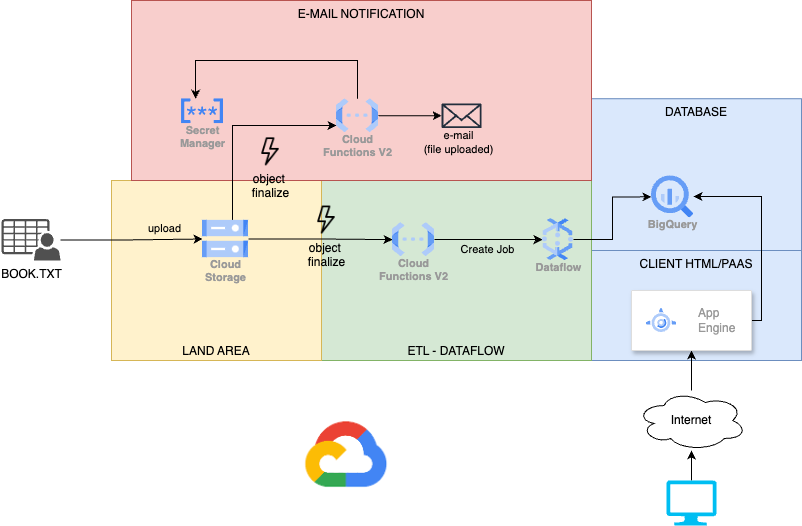

# Book To Phrases

## Aim

This project contains the Terrafom scripts to create an infrastructure that gets a book in TXT format, parses it into
phrases, adds some information to each phrase, stores it, and exposes it on a simple HTML page.

You can find an article about this project [here](https://www.intre.it/blog). #TODO

## Diagram

This diagram shows the resources created by this project.


## Run script

### Requirements

The requirements for this project are the following:

- Account Google Cloud Provider
- Google project
- SendGrid Account (optional, you can skip this part if you are not interested in the e-mail notification part)
- Installed tools (The Google Cloud Shell has already these tools installed)
    - Terraform
    - gcoud cli

### Variables

#### Optional

- location: the location of the resources (default is "europe-west8", Milan)
- app_engine_location: the location of the app engine service (default is "europe-west6")
- app_engine_service_name: the name of the app engine service (default is "default"). The first app engine service MUST
  be named "default"
- dataflow_batch_image: the dataflow flex template docker image (default is "th3nu11/dataflow-booktophrases:v3"). If you
  want to build your own image, check the [dataflow folder](./dataflow-templates/README.md)

#### Required

- project: the Google project id where you want to create the resources
- sendgrid_api_key: the sendgrid key. In case you don't want to use the e-mail notification, use a fake key (the cloud
  function will not send the e-mail but will throw an error)
- mail_sender: the mail sender used to send the notification, it is the one you’ve registered in send grid (the cloud
  function will not send the e-mail but will throw an error)
- mail_receiver: the email where you want to receive the notification (the cloud function will not send the e-mail but
  will throw an error)

### Installation procedure

```
export TF_VAR_project ="your project id, where you want create the resources"
export TF_VAR_sendgrid_api_key="the sendgrid key"
export TF_VAR_mail_sender="the mail sender used to send the notification, it is the one you’ve registered in send grid"
export TF_VAR_mail_receiver="the email where you want receive the notification"

gcloud auth login
terraform init 
terraform apply
```

### Destroy all resources

```
terraform destroy
```
