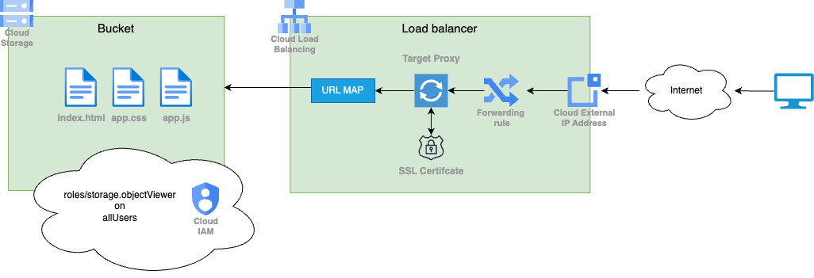

# Hosting a static website on a Cloud Bucket

## AIM

This project installs a static website on a GCP bucket, you can find an article about this
project [here](https://www.intre.it/blog). //TODO

## Diagram

The following diagram the resources created by this project.


## Arguments

### Required

- project_id: The GCP project id
- domain: The domain of the website (example.com). You must own the domain and have access to the DNS configuration.

### Optional

- location: The location of the bucket (default is "europe-west8", Milan)
- bucket_name: The name of the bucket (default is "static-website-bucket"). A random string is added to the name to
  avoid conflicts.

## Run scripts

### Requirements

To run the scripts you need:

- terraform
- gcloud (connected to the project)
- gcp project
- domain (owned and with access to the DNS configuration)

### Installation procedure

```
terraform init
terraform apply -var project_id={your project id, ex: myproject-123456} -var domain={your domain, ex: cloud-web-app.intre.it}
```

### Destroy all resources

```
terraform destroy -var project_id={your project id, ex: myproject-123456} -var domain={your domain, ex: cloud-web-app.intre.it}
```

### Clean cache

The loadbalancer caches the data. To clean the cache you can run the following command (remember to replace bucket name
with the correct value)

```
gcloud compute url-maps invalidate-cdn-cache {bucket name}-https-lb --path=/*
```
This operation can take several minutes.