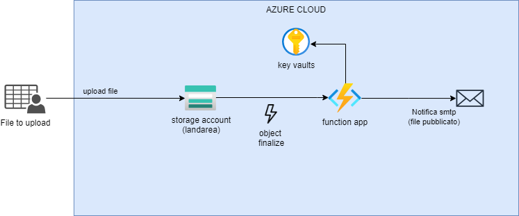

# Storage Notifier

## Aim
This project contains the Terrafom scripts to create an infrastructure that get a notification when a file is uploaded to a storage account.


## Diagram
This diagram shows the resources created by this project.


## Run script

### Requirements

The requirements for this project are the following:

- Account Azure
- Azure subscription
- SendGrid Account 
- Installed tools (The Azure Cloud Shell has already these tools installed)
    - Terraform
    - azure cli
    - Node.js

### Variables

- rg_name: the name of the resource group (default is "myrg")
- location: the location of the resources (default is "westeurope")
- sendgrid_api_key: the sendgrid key. 
- mail_sender: the mail sender used to send the notification, it is the one you’ve registered in send grid
- mail_receiver: the email where you want to receive the notification

### Installation Procedure

Before running the Terraform commands, you need to install the dependencies for the cloud function. Navigate to the cloud function directory and run:

```
cd modules/storage-notifier/function-source

npm install
```

Then, execute the following commands to configure and apply the infrastructure:

```
export TF_VAR_rg_name="your resource group name"
export TF_VAR_location="your location"
export TF_VAR_sendgrid_api_key="the SendGrid key"
export TF_VAR_mail_sender="the email sender used to send the notification, which you’ve registered in SendGrid"
export TF_VAR_mail_receiver="the email where you want to receive the notification"

az login
terraform init
terraform apply
```

## Destroy All Resources

To destroy all resources created by this project, run:

```
terraform destroy
```

